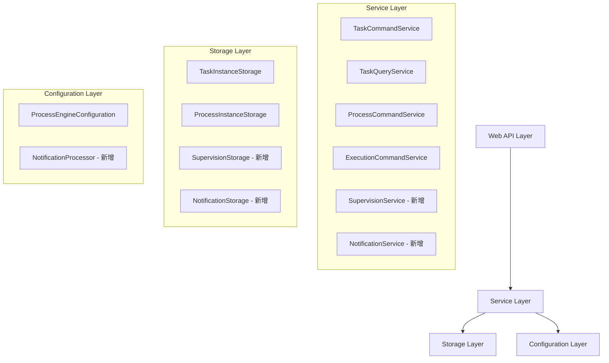

# 工作流管理系统增强功能设计文档

## 概述

本设计文档基于SmartEngine现有架构，扩展实现工作流管理的高级功能。SmartEngine采用分层架构设计，包含Service层（Command/Query）、Storage层、Configuration层等核心组件。我们将在现有架构基础上进行功能增强，确保与现有系统的兼容性和一致性。

## 架构设计

### 整体架构



### 数据库扩展设计

基于现有数据库表结构，需要新增以下表：

```sql
-- 督办记录表
CREATE TABLE `se_supervision_instance` (
  `id` bigint(20) unsigned NOT NULL AUTO_INCREMENT COMMENT 'PK',
  `gmt_create` datetime(6) NOT NULL COMMENT 'create time',
  `gmt_modified` datetime(6) NOT NULL COMMENT 'modification time',
  `process_instance_id` bigint(20) unsigned NOT NULL COMMENT 'process instance id',
  `task_instance_id` bigint(20) unsigned NOT NULL COMMENT 'task instance id',
  `supervisor_user_id` varchar(255) NOT NULL COMMENT 'supervisor user id',
  `supervision_reason` varchar(500) DEFAULT NULL COMMENT 'supervision reason',
  `supervision_type` varchar(64) NOT NULL COMMENT 'supervision type: urge/track/remind',
  `status` varchar(64) NOT NULL COMMENT 'status: active/closed',
  `tenant_id` varchar(64) DEFAULT NULL COMMENT 'tenant id',
  PRIMARY KEY (`id`)
);

-- 知会抄送表
CREATE TABLE `se_notification_instance` (
  `id` bigint(20) unsigned NOT NULL AUTO_INCREMENT COMMENT 'PK',
  `gmt_create` datetime(6) NOT NULL COMMENT 'create time',
  `gmt_modified` datetime(6) NOT NULL COMMENT 'modification time',
  `process_instance_id` bigint(20) unsigned NOT NULL COMMENT 'process instance id',
  `task_instance_id` bigint(20) unsigned DEFAULT NULL COMMENT 'task instance id',
  `sender_user_id` varchar(255) NOT NULL COMMENT 'sender user id',
  `receiver_user_id` varchar(255) NOT NULL COMMENT 'receiver user id',
  `notification_type` varchar(64) NOT NULL COMMENT 'notification type: cc/inform',
  `title` varchar(255) DEFAULT NULL COMMENT 'notification title',
  `content` varchar(1000) DEFAULT NULL COMMENT 'notification content',
  `read_status` varchar(64) NOT NULL DEFAULT 'unread' COMMENT 'read status: unread/read',
  `read_time` datetime(6) DEFAULT NULL COMMENT 'read time',
  `tenant_id` varchar(64) DEFAULT NULL COMMENT 'tenant id',
  PRIMARY KEY (`id`)
);

-- 任务移交记录表（扩展现有transfer功能）
CREATE TABLE `se_task_transfer_record` (
  `id` bigint(20) unsigned NOT NULL AUTO_INCREMENT COMMENT 'PK',
  `gmt_create` datetime(6) NOT NULL COMMENT 'create time',
  `gmt_modified` datetime(6) NOT NULL COMMENT 'modification time',
  `task_instance_id` bigint(20) unsigned NOT NULL COMMENT 'task instance id',
  `from_user_id` varchar(255) NOT NULL COMMENT 'from user id',
  `to_user_id` varchar(255) NOT NULL COMMENT 'to user id',
  `transfer_reason` varchar(500) DEFAULT NULL COMMENT 'transfer reason',
  `deadline` datetime(6) DEFAULT NULL COMMENT 'processing deadline',
  `tenant_id` varchar(64) DEFAULT NULL COMMENT 'tenant id',
  PRIMARY KEY (`id`)
);
```

## 组件和接口设计

### 1. 督办管理服务

```java
public interface SupervisionCommandService {
    /**
     * 发起督办
     */
    SupervisionInstance createSupervision(String taskInstanceId, String supervisorUserId, 
                                        String reason, SupervisionType type, String tenantId);
    
    /**
     * 关闭督办
     */
    void closeSupervision(String supervisionId, String tenantId);
    
    /**
     * 批量督办
     */
    List<SupervisionInstance> batchCreateSupervision(List<String> taskInstanceIds, 
                                                   String supervisorUserId, String reason, 
                                                   SupervisionType type, String tenantId);
}

public interface SupervisionQueryService {
    /**
     * 查询督办记录
     */
    List<SupervisionInstance> findSupervisionList(SupervisionQueryParam param);
    
    /**
     * 统计督办数量
     */
    Long countSupervision(SupervisionQueryParam param);
    
    /**
     * 查询活跃督办
     */
    List<SupervisionInstance> findActiveSupervisionByTask(String taskInstanceId, String tenantId);
}
```

### 2. 知会抄送服务

```java
public interface NotificationCommandService {
    /**
     * 发送知会通知
     */
    NotificationInstance sendNotification(String processInstanceId, String taskInstanceId,
                                        String senderUserId, List<String> receiverUserIds,
                                        String title, String content, String tenantId);
    
    /**
     * 标记已读
     */
    void markAsRead(String notificationId, String tenantId);
    
    /**
     * 批量标记已读
     */
    void batchMarkAsRead(List<String> notificationIds, String tenantId);
}

public interface NotificationQueryService {
    /**
     * 查询知会列表
     */
    List<NotificationInstance> findNotificationList(NotificationQueryParam param);
    
    /**
     * 统计未读数量
     */
    Long countUnreadNotifications(String receiverUserId, String tenantId);
}
```

### 3. 任务查询服务扩展

```java
// 扩展现有TaskQueryService
public interface TaskQueryService {
    // 现有方法...
    
    /**
     * 查询已办任务 - 基于现有findList方法扩展
     */
    List<TaskInstance> findCompletedTaskList(CompletedTaskQueryParam param);
    
    /**
     * 统计已办任务数量
     */
    Long countCompletedTaskList(CompletedTaskQueryParam param);
}

// 新增查询参数类
@Data
@EqualsAndHashCode(callSuper = true)
public class CompletedTaskQueryParam extends BaseQueryParam {
    private String claimUserId;
    private List<String> processDefinitionTypes;
    private Date completeTimeStart;
    private Date completeTimeEnd;
    private String status = TaskInstanceConstant.COMPLETED; // 固定为completed状态
}
```

### 4. 流程查询服务扩展

```java
// 扩展现有ProcessQueryService
public interface ProcessQueryService {
    // 现有方法...
    
    /**
     * 查询办结流程 - 基于现有findList方法扩展
     */
    List<ProcessInstance> findCompletedProcessList(CompletedProcessQueryParam param);
    
    /**
     * 统计办结流程数量
     */
    Long countCompletedProcessList(CompletedProcessQueryParam param);
}

// 新增查询参数类
@Data
@EqualsAndHashCode(callSuper = true)
public class CompletedProcessQueryParam extends BaseQueryParam {
    private String participantUserId; // 参与用户ID
    private List<String> processDefinitionTypes;
    private Date completeTimeStart;
    private Date completeTimeEnd;
    private String status = InstanceStatus.completed.name(); // 固定为completed状态
}
```

### 5. 任务命令服务扩展

```java
// 扩展现有TaskCommandService
public interface TaskCommandService {
    // 现有方法...
    
    /**
     * 增强的任务移交 - 基于现有transfer方法扩展
     */
    void transferWithDetails(String taskId, String fromUserId, String toUserId, 
                           String reason, Date deadline, String tenantId);
    
    /**
     * 流程回退到上一节点 - 基于ExecutionCommandService.jumpTo()实现
     */
    ProcessInstance rollbackToPreviousNode(String taskId, String userId, String reason, String tenantId);
    
    /**
     * 流程回退到指定节点 - 基于ExecutionCommandService.jumpTo()实现
     */
    ProcessInstance rollbackToSpecificNode(String taskId, String targetActivityId, 
                                         String userId, String reason, String tenantId);
}
```

## 数据模型设计

### 督办实例模型

```java
public class SupervisionInstance extends AbstractInstance {
    private Long processInstanceId;
    private Long taskInstanceId;
    private String supervisorUserId;
    private String supervisionReason;
    private SupervisionType supervisionType;
    private SupervisionStatus status;
    private Date closeTime;
    private String tenantId;
}

public enum SupervisionType {
    URGE,    // 催办
    TRACK,   // 跟踪
    REMIND   // 提醒
}

public enum SupervisionStatus {
    ACTIVE,  // 活跃
    CLOSED   // 已关闭
}
```

### 知会通知模型

```java
public class NotificationInstance extends AbstractInstance {
    private Long processInstanceId;
    private Long taskInstanceId;
    private String senderUserId;
    private String receiverUserId;
    private NotificationType notificationType;
    private String title;
    private String content;
    private ReadStatus readStatus;
    private Date readTime;
    private String tenantId;
}

public enum NotificationType {
    CC,      // 抄送
    INFORM   // 知会
}

public enum ReadStatus {
    UNREAD,  // 未读
    READ     // 已读
}
```

### 任务移交记录模型

```java
public class TaskTransferRecord extends AbstractInstance {
    private Long taskInstanceId;
    private String fromUserId;
    private String toUserId;
    private String transferReason;
    private Date deadline;
    private String tenantId;
}
```

## 错误处理

### 异常类型定义

```java
public class SupervisionException extends EngineException {
    public SupervisionException(String message) {
        super(message);
    }
}

public class NotificationException extends EngineException {
    public NotificationException(String message) {
        super(message);
    }
}

public class RollbackException extends EngineException {
    public RollbackException(String message) {
        super(message);
    }
}
```

### 错误处理策略

1. **参数验证错误**: 返回ValidationException，包含详细的参数错误信息
2. **业务逻辑错误**: 返回对应的业务异常，如SupervisionException
3. **数据库操作错误**: 由底层Storage层处理，转换为EngineException
4. **并发冲突错误**: 返回ConcurrentException，支持重试机制

## 测试策略

### 单元测试

- 每个新增Service接口的实现类都需要完整的单元测试
- 测试覆盖率要求达到80%以上
- 重点测试边界条件和异常情况

### 集成测试

- 基于现有DatabaseBaseTestCase进行集成测试
- 测试与现有SmartEngine功能的兼容性
- 测试多租户场景下的数据隔离

### 性能测试

- 大数据量下的查询性能测试
- 并发操作的性能和稳定性测试
- 数据库索引优化验证

## 正确性属性

*属性是一个特征或行为，应该在系统的所有有效执行中保持为真——本质上是关于系统应该做什么的正式声明。属性作为人类可读规范和机器可验证正确性保证之间的桥梁。*

基于需求分析，我们定义了以下正确性属性来验证系统行为：

### 属性 1: 状态筛选查询正确性
*对于任何*查询请求，当指定状态筛选条件时，返回的所有记录都应该匹配指定的状态
**验证需求: Requirements 1.1, 2.1**

### 属性 2: 查询结果数据完整性
*对于任何*查询操作，返回的记录都应该包含所有必需的字段且字段值不为空
**验证需求: Requirements 1.2, 2.2**

### 属性 3: 查询筛选和分页一致性
*对于任何*带有筛选条件和分页参数的查询，返回结果应该正确应用筛选条件且分页参数有效
**验证需求: Requirements 1.4, 1.5, 2.4, 2.5, 7.5**

### 属性 4: 督办状态管理正确性
*对于任何*督办操作，当任务完成时督办状态应该自动关闭，当任务被督办时优先级应该提高
**验证需求: Requirements 3.4, 3.5**

### 属性 5: 加签操作一致性
*对于任何*加签操作，被加签人应该被正确添加到任务处理人列表中，且所有加签人完成后流程应该继续
**验证需求: Requirements 4.1, 4.3**

### 属性 6: 流程回退状态保持
*对于任何*流程回退操作，历史处理记录应该被保留，且流程应该正确回退到目标节点
**验证需求: Requirements 5.1, 5.4**

### 属性 7: 指定回退数据清理
*对于任何*指定节点回退操作，回退节点之后的所有处理记录应该被清除
**验证需求: Requirements 6.4**

### 属性 8: 知会抄送流程独立性
*对于任何*知会抄送操作，不应该影响原流程的状态和流转
**验证需求: Requirements 7.3**

### 属性 9: 已读状态更新正确性
*对于任何*知会查看操作，应该正确更新已读状态和已读时间
**验证需求: Requirements 7.4**

### 属性 10: 减签会签规则重计算
*对于任何*减签操作，应该根据剩余审批人重新计算会签规则
**验证需求: Requirements 8.3**

### 属性 11: 任务移交所有权转移
*对于任何*任务移交操作，任务的处理权应该完全转移给接收人
**验证需求: Requirements 9.1**

### 属性 12: 操作记录完整性
*对于任何*督办、加签、回退、减签、移交操作，都应该记录完整的操作信息包括操作人、时间、原因等
**验证需求: Requirements 3.2, 4.4, 5.3, 6.5, 8.4, 9.2**

### 属性 13: 边界条件处理正确性
*对于任何*边界情况（如空查询结果、起始节点回退、全员减签），系统应该正确处理而不是抛出异常
**验证需求: Requirements 1.3, 2.3, 5.5, 8.5**

### 属性 14: 查询和操作权限一致性
*对于任何*用户操作，应该基于用户权限正确执行查询和操作，确保数据安全
**验证需求: Requirements 3.1, 4.1, 5.1, 6.1, 7.1, 8.1, 9.1**

### 属性 15: 历史节点查询准确性
*对于任何*指定回退操作，应该基于ActivityQueryService.findAll()准确显示可回退的历史节点
**验证需求: Requirements 6.1**