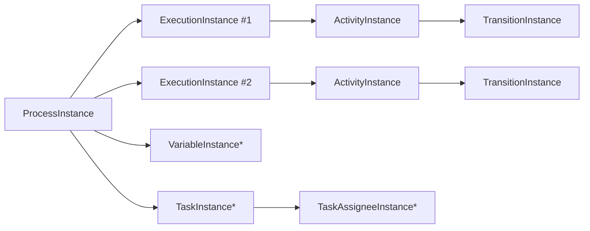

# 执行模型：token / ExecutionInstance / 暂停点 / signal 语义

SmartEngine 的运行期核心在于：**一个流程实例 ProcessInstance，内部可能有多个 ExecutionInstance（token）并行推进**。

本章从“你写业务系统会遇到的问题”出发，解释：

- token 是什么、什么时候会变多
- ReceiveTask/暂停点如何通过 signal 推进
- 并行网关 join 为什么需要并发控制
- ActivityInstance / TransitionInstance 在哪里发挥作用

---

## 1. 核心对象关系（概念图）

- 并行分叉会使 ExecutionInstance 数量增加
- join 需要等待多个 ExecutionInstance 到达同一网关

---

## 2. token（ExecutionInstance）到底是什么？

在 SmartEngine 中，ExecutionInstance 可以理解为：

- “当前执行推进的位置 + 上下文”
- “并行时的分支载体”

典型场景：

- **顺序流**：一般只有一个活跃 execution
- **并行网关分叉**：会创建多个 execution（每个分支一个）
- **并行网关 join**：多个 execution 汇合为一个推进点

---

## 3. ActivityInstance 与暂停点（ReceiveTask）

### 3.1 ReceiveTask 为什么需要 signal？

ReceiveTask 的语义通常是：

- 引擎执行到该节点后进入等待状态
- 外部事件到来后，通过 `ExecutionCommandService.signal(...)` 继续推进

也就是说：**ReceiveTask 不是自动推进的，它需要外部触发**。

### 3.2 signal 的对象是谁？

signal 通常作用在：

- 某个 execution（executionInstanceId）
- 或某个 processInstance（由引擎内部定位 active execution）

具体重载方法详见 `ExecutionCommandService`（见 `03-usage/api-guide.md`）。

---

## 4. 并行网关 join：为什么“最容易踩坑”？

并行 join 的两类常见坑：

1) **重复推进**：多个线程/节点同时判断“已满足 join 条件”，导致后续节点被执行多次  
2) **丢推进**：某些分支状态未正确落库/未正确计数，导致 join 永远等不到

SmartEngine 在并行处理上引入了：

- 可配置的 ExecutorService（按节点属性或默认线程池）
- latch 等等待控制（见 `ParallelGatewayUtil`）
- 以及历史遗留的锁扩展点 `LockStrategy`（Deprecated）

建议阅读：`05-extensibility/concurrency.md`

---

## 5. “完成/跳过”语义：markDone / jump

除了标准推进外，SmartEngine 还提供：

- `markDone`：把某个 execution / activity 标记完成（常见于补偿或人工处理）
- `jumpFrom` / `jumpTo`：流程跳转（见 `03-usage/jump-and-advanced.md`）

这些能力在“异常补偿、人工干预、重跑”场景非常关键，但也意味着你必须：

- 明确幂等（避免重复跳转）
- 明确数据一致性（尤其是 DataBase 模式下任务/变量）

---

下一步：

- 领域对象与表结构：`domain-model.md`
- 并发专题：`05-extensibility/concurrency.md`

