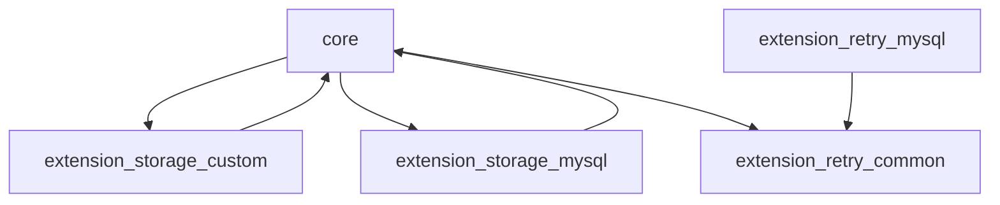

# 架构：core / extension / docs 的模块划分与依赖关系

SmartEngine 仓库按 Maven 多模块组织（根 `pom.xml`）：

```text
- core
- extension/storage/storage-common
- extension/storage/storage-custom
- extension/storage/storage-mysql
- extension/retry/retry-common
- extension/retry/retry-custom
- extension/retry/retry-mysql
```


---

## 1. core（引擎内核）

目录：`core/`

职责：

- BPMN 解析（parser）
- 执行模型（process/execution/activity/token）
- 行为实现（serviceTask/receiveTask/gateway…）
- 对外服务接口（SmartEngine + Command/QueryService）
- 扩展机制（ExtensionBinding、AnnotationScanner、ExtensionContainer）
- 常量、工具、异常处理（ExceptionProcessor 等）

依赖要求尽量轻（README 中强调 “Less Dependent / avoid JAR hell”）。

---

## 2. extension（可插拔扩展）

目录：`extension/`

### 2.1 storage（存储实现）

- `storage-custom`：测试/示例存根，实现 Storage 接口但不落库
- `storage-mysql`：DataBase 模式实现（MyBatis + DDL + SQLMap）

### 2.2 retry（失败重试）

- `retry-common`：注解与公共抽象（@Retryable 等）
- `retry-mysql`：重试记录的关系库存储（含 DDL）

---

## 3. ecology（生态/工具）

目录：`ecology/`

仓库中包含一些与“建模/设计器/适配”相关的代码（例如 designer），通常不影响 core 的运行期语义，但对平台化落地有价值（例如你做低代码建模器时可以复用其中的结构）。

---

## 4. 依赖方向（建议）



原则：

- core 不依赖具体存储
- extension 依赖 core
- 不要在 core 中引入强耦合框架（保持可嵌入性）

---

## 5. 你做二开时的推荐分层

如果你要做“SmartEngine + 业务平台”的深度集成，建议你在业务仓库中按以下分层组织：

- `engine-adapter`：对 SmartEngine 的封装（tenant、幂等、审计、监控）
- `engine-storage-impl`：自研 Storage（支持多 DB/历史/归档）
- `engine-user-integration`：组织/角色/权限/待办查询 read model
- `engine-ops`：监控、告警、数据清理、压测脚本

这样你可以保持引擎内核的可升级性，同时把“平台特有能力”外置。

